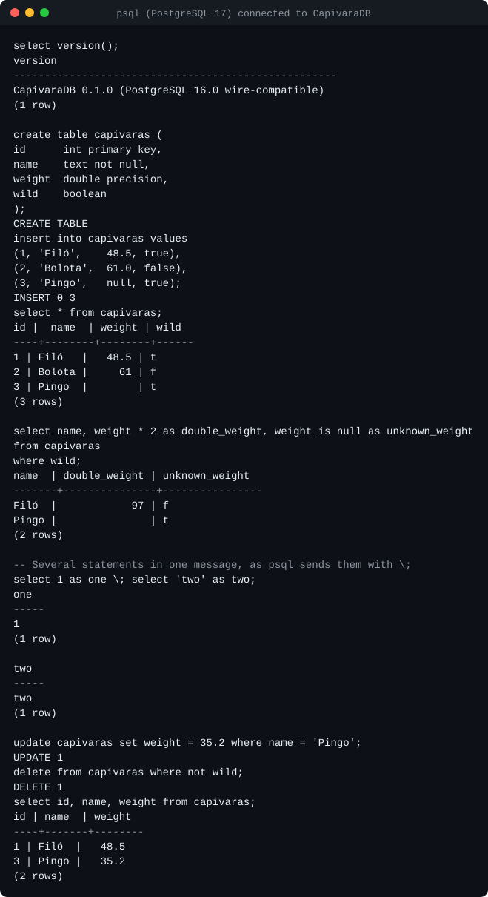
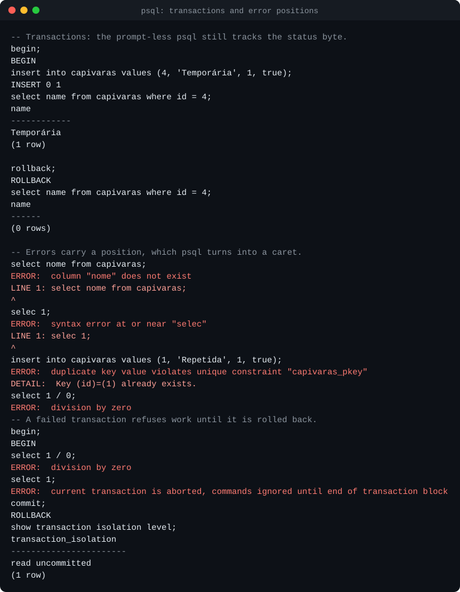
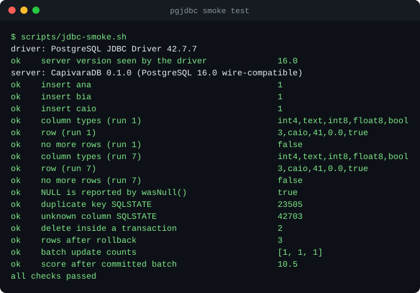
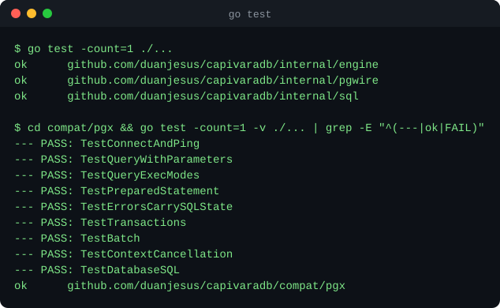

# CapivaraDB

A relational SQL database written from scratch in Go, speaking the PostgreSQL
wire protocol — so `psql`, pgx, JDBC and anything else that talks to Postgres
can connect to it.

The point of the project is to build every layer of a database by hand: the
network protocol, the SQL parser, the on-disk storage engine, write-ahead
logging with crash recovery, MVCC transactions, and a query planner and
executor. **The core has no dependencies outside the Go standard library**;
CI fails if one is added.

> **Status: milestone 1 of 7.** The wire protocol is complete and verified
> against real clients. Behind it sits a deliberately simple in-memory engine
> that the following milestones replace. Nothing is persisted yet. See
> [Limitations](#limitations) for exactly what that means.



## Milestones

| # | Milestone | State |
|---|-----------|-------|
| 1 | PostgreSQL wire protocol v3: startup, simple and extended query, cancellation | **done** |
| 2 | Hand-written SQL parser: joins, `GROUP BY`, `ORDER BY`, `LIMIT`, full DDL/DML | next |
| 3 | Storage engine: slotted pages, buffer pool, B+tree tables and secondary indexes | planned |
| 4 | Write-ahead log, ARIES-style recovery, kill-the-process crash tests | planned |
| 5 | MVCC with snapshot isolation, concurrent transactions, isolation tests | planned |
| 6 | Cost-based planner: index selection, join ordering, `EXPLAIN` | planned |
| 7 | Volcano executor: hash and merge joins, aggregation, external sort | planned |

Running alongside all of them: a [sqllogictest](https://www.sqlite.org/sqllogictest/)
runner to measure compatibility, and reproducible benchmarks. Details in
[docs/roadmap.md](docs/roadmap.md).

## Quick start

Requires Go 1.27 or newer.

```bash
go run ./cmd/capivaradb -addr 127.0.0.1:5432
```

Then, from any PostgreSQL client:

```bash
psql -h 127.0.0.1 -U ana capi
```

```sql
create table capivaras (id int primary key, name text not null, weight double precision);
insert into capivaras values (1, 'Filó', 48.5), (2, 'Bolota', 61);
select name, weight * 2 from capivaras where weight > 50;
```

Any user name is accepted and no password is asked for, which is why the
server listens on loopback only unless told otherwise.

## What works today

**Protocol** ([details](docs/wire-protocol.md))

- Startup, including the `SSLRequest`/`GSSENCRequest` refusal and protocol
  minor-version negotiation.
- Simple query protocol, with multiple statements per message.
- Extended query protocol: `Parse`, `Bind`, `Describe`, `Execute`, `Close`,
  `Sync`, `Flush`; named and unnamed statements and portals; row limits with
  `PortalSuspended`; pipelining with correct skip-to-`Sync` error recovery.
- Text and binary formats for parameters and results.
- Parameter type inference when the client does not declare types
  (`where id = $1` reports `int4` back to the driver).
- Query cancellation through `CancelRequest`.
- Errors with SQLSTATE codes and character positions, so psql can point at
  the offending token:



**SQL** (the subset needed to exercise the protocol; milestone 2 widens it)

- `CREATE TABLE` / `DROP TABLE` with `PRIMARY KEY` and `NOT NULL`
- `INSERT ... VALUES`, `UPDATE`, `DELETE`, `SELECT ... FROM one_table WHERE ...`
- Types: `integer`, `bigint`, `double precision`, `text`, `boolean`
- Expressions: arithmetic with overflow checks, comparisons, `AND`/`OR`/`NOT`
  with three-valued logic, `IS [NOT] NULL`, `||`, `::` casts, a few functions
- `BEGIN` / `COMMIT` / `ROLLBACK` with real rollback and statement atomicity
- `SET` / `SHOW`

## Verified against real clients

| Client | How | Where |
|--------|-----|-------|
| psql 17 | A scripted session compared with a checked-in expected output | [compat/psql](compat/psql), `scripts/psql-smoke.sh` |
| pgx v5 (Go) | Every query execution mode, prepared statements, batches, transactions, cancellation, `database/sql` | [compat/pgx](compat/pgx) |
| pgjdbc 42.7 (Java) | Typed parameters, server-side prepare threshold, batches, autocommit off, SQLSTATE mapping | [compat/jdbc](compat/jdbc), `scripts/jdbc-smoke.sh` |



On top of that, the protocol has its own test suite that speaks raw bytes
over a socket, with a client written in the test file from the protocol
specification. It covers what well-behaved drivers never send: malformed
messages, wrong cancellation keys, oversized length prefixes, bad format
codes.



## Architecture

```
            psql / pgx / JDBC
                   │  PostgreSQL protocol v3 over TCP
        ┌──────────▼──────────┐
        │   internal/pgwire   │  framing, startup, simple + extended query,
        │                     │  portals, formats, cancellation
        └──────────┬──────────┘
                   │  Handler / Session / Prepared / Rows interfaces
        ┌──────────▼──────────┐
        │   internal/engine   │  name resolution, type checking,
        │   (milestone 1:     │  expression compilation, execution
        │    in-memory)       │
        └──────────┬──────────┘
                   │
        ┌──────────▼──────────┐
        │    internal/sql     │  lexer, AST, recursive-descent + Pratt parser
        └─────────────────────┘
```

The protocol layer knows nothing about SQL and the engine knows nothing
about sockets; they meet at four small interfaces. That boundary is what
lets the engine be swapped out milestone by milestone while the client
compatibility tests keep passing. More in
[docs/architecture.md](docs/architecture.md); the reasoning behind the main
choices is recorded in [docs/decisions](docs/decisions).

## Running the tests

```bash
go test ./...                          # core: parser, engine, raw protocol
(cd compat/pgx && go test ./...)       # pgx driver
bash scripts/jdbc-smoke.sh             # pgjdbc; needs a JDK and curl
bash scripts/psql-smoke.sh             # psql; uses Docker if psql is not installed
```

CI runs all of it on Linux (core suite under the race detector), plus the core
and pgx suites on Windows. See [docs/development.md](docs/development.md).

## Limitations

Stated plainly, because a database that overstates what it guarantees is
worse than useless.

- **No durability.** Data lives in memory and is gone when the process
  exits. (Milestones 3 and 4.)
- **No isolation.** Changes are visible to other sessions the moment a
  statement runs, before `COMMIT`. `SHOW transaction_isolation` answers
  `read uncommitted`, which is the truth. Rollback does undo a transaction's
  changes, but if two open transactions touched the same rows the result is
  not what a real database would give. (Milestone 5.)
- **One global lock.** Writers exclude everyone for the duration of a
  statement.
- **No indexes.** Every query is a full scan; a primary key is enforced by
  scanning the table.
- **A small SQL subset.** No joins, `ORDER BY`, `LIMIT`, aggregates,
  subqueries, `DEFAULT`, or table-level constraints yet. `varchar(n)` is
  accepted but the length is not enforced.
- **No system catalogs.** psql's `\d` commands and GUI tools that inspect
  `pg_catalog` do not work.
- **No authentication and no TLS.** Trust authentication only; the client's
  request for SSL is declined.
- **No `COPY`**, no `LISTEN`/`NOTIFY`, no function-call sub-protocol.
- A multi-statement simple query is not wrapped in an implicit transaction
  as PostgreSQL does: statements before a failing one stay applied.
- The data types are a handful; there is no `numeric`, no date/time types.

## Repository layout

```
cmd/capivaradb     the server binary
internal/pgwire    PostgreSQL wire protocol
internal/sql       lexer, AST, parser
internal/engine    binder and executor (in-memory for now)
internal/pgerr     errors with SQLSTATE codes
compat/            tests against real clients (separate modules; may have dependencies)
tools/termshot     renders command output as the SVG screenshots in docs/
scripts/           smoke tests and screenshot generation
docs/              architecture, protocol notes, decisions, roadmap
```

## License

[MIT](LICENSE)
