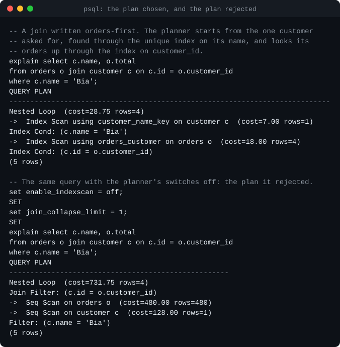
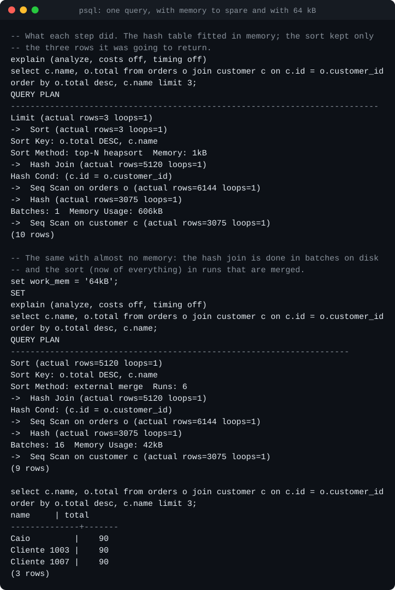
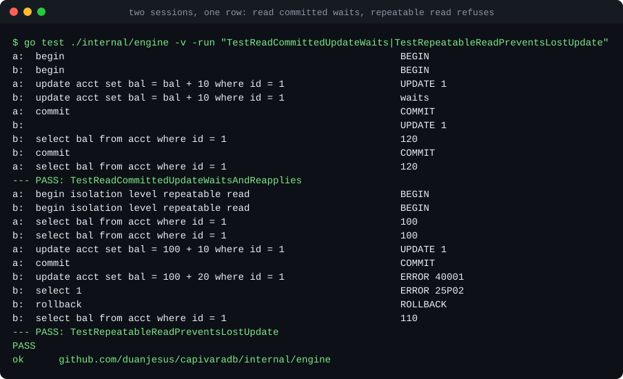
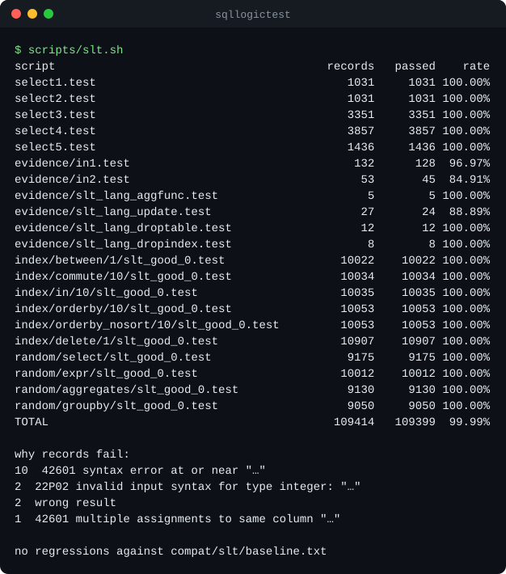
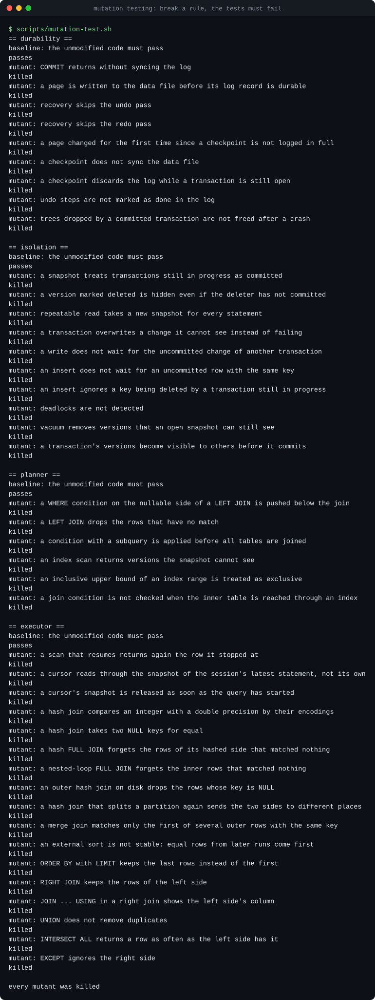
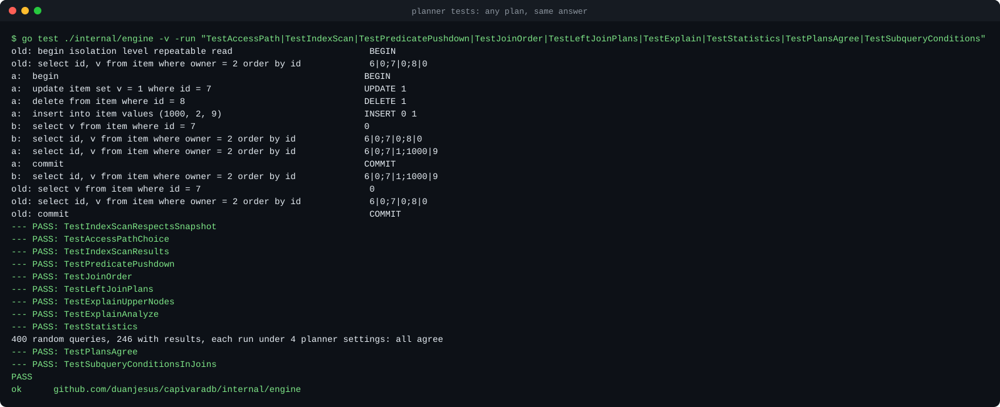
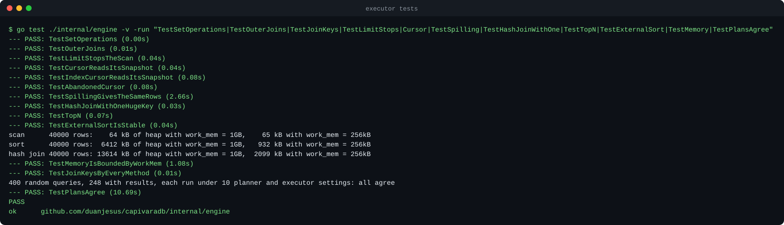
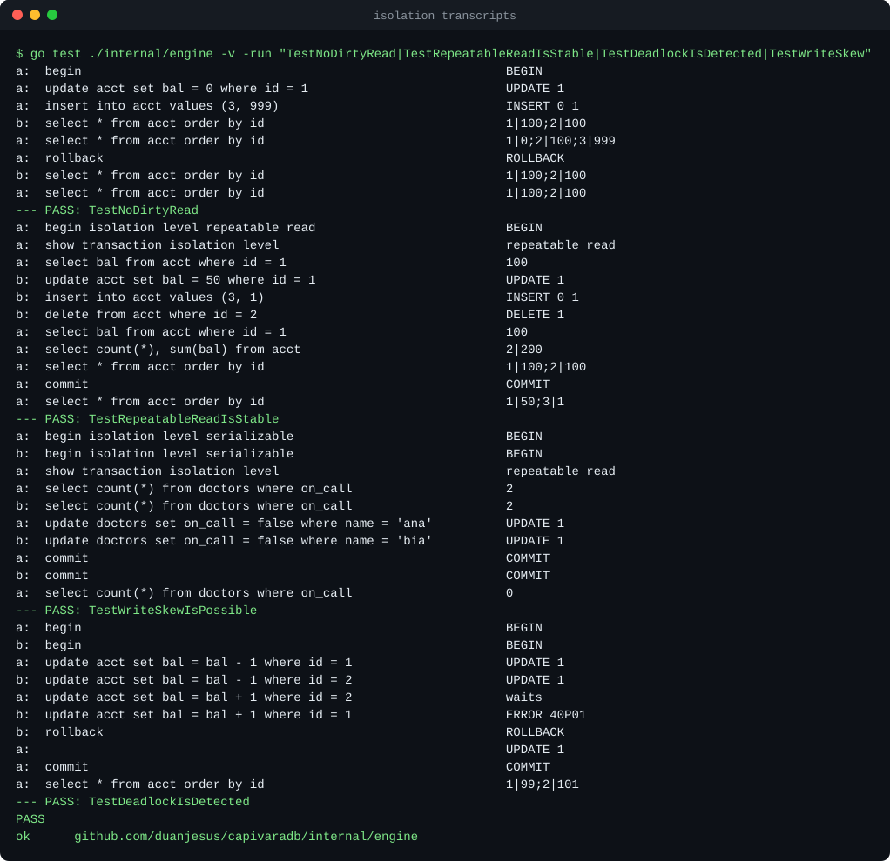
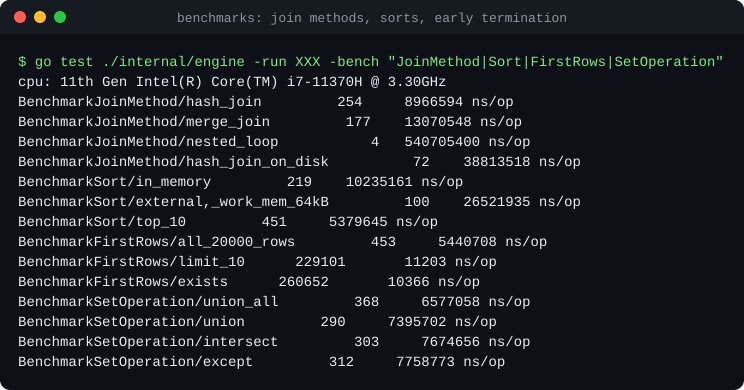

# CapivaraDB

A relational SQL database written from scratch in Go, speaking the PostgreSQL
wire protocol — so `psql`, pgx, JDBC and anything else that talks to Postgres
can connect to it.

The point of the project is to build every layer of a database by hand: the
network protocol, the SQL parser, the on-disk storage engine, write-ahead
logging with crash recovery, MVCC transactions, and a query planner and
executor. **The core has no dependencies outside the Go standard library**;
CI fails if one is added.

> **Status: all seven planned milestones are done.** Data lives in B+trees
> in a page file; a committed transaction survives the server being killed
> or the power failing; concurrent transactions are isolated from each
> other by snapshots; queries are planned by cost and run by an iterator
> executor with hash and merge joins, whose memory is bounded by
> `work_mem` whatever the size of the data. It is a learning project, not a
> product: see [Limitations](#limitations) for exactly what it does not do.


## Milestones

| # | Milestone | State |
|---|-----------|-------|
| 1 | PostgreSQL wire protocol v3: startup, simple and extended query, cancellation | **done** |
| 2 | Hand-written SQL parser and binder: joins, grouping, subqueries, DDL; fuzzing; sqllogictest | **done** |
| 3 | Storage engine: slotted pages, buffer pool, B+tree tables and secondary indexes, persistent catalog | **done** |
| 4 | Write-ahead log, ARIES-style recovery, crash tests on a simulated disk and by killing the process | **done** |
| 5 | MVCC: snapshot isolation, waiting writers, deadlock detection, vacuum, isolation tests | **done** |
| 6 | Cost-based planner: predicate pushdown, index selection, join ordering, statistics, `EXPLAIN ANALYZE` | **done** |
| 7 | Volcano executor: streaming cursors, hash and merge joins, external sort, set operations, outer joins | **done** |

Details in [docs/roadmap.md](docs/roadmap.md).

## Quick start

Requires Go 1.27 or newer.

```bash
go run ./cmd/capivaradb -data capi.cdb
```

Without `-data` the database lives in memory. `-cache 64` sets the buffer
pool to 64 MB, `-addr` the listening address (default `127.0.0.1:5432`).

Then, from any PostgreSQL client:

```bash
psql -h 127.0.0.1 -U ana capi
```

```sql
create table capivaras (id int primary key, name text not null, weight double precision);
insert into capivaras values (1, 'Filó', 48.5), (2, 'Bolota', 61);
select name, weight * 2 from capivaras where weight > 50;
```

Any user name is accepted and no password is asked for, which is why the
server listens on loopback only unless told otherwise.

A commit is durable when it is acknowledged: the write-ahead log, kept in
`capi.cdb.wal`, is synced first. If the server dies, the next start recovers
from the log and says so. `capivaradb -data capi.cdb -check` verifies a file
offline; `-nosync` trades the power-failure guarantee for speed.

## What works today

### SQL

- **Queries:** `SELECT` with `INNER` / `LEFT` / `RIGHT` / `FULL` / `CROSS`
  joins, `JOIN ... USING`, subqueries in `FROM`, `WHERE`, `GROUP BY`,
  `HAVING`, `DISTINCT`, `ORDER BY` (with `NULLS FIRST/LAST`, positions and
  aliases), `LIMIT` / `OFFSET`.
- **Set operations:** `UNION`, `INTERSECT`, `EXCEPT`, each with `ALL`.
- **Subqueries in expressions:** scalar, `EXISTS`, `IN (SELECT ...)`,
  correlated to any depth.
- **Expressions:** arithmetic with overflow checks, comparisons, three-valued
  `AND`/`OR`/`NOT`, `CASE`, `IN`, `BETWEEN`, `LIKE`/`ILIKE`, `IS NULL`, `||`,
  `CAST` and `::`, `COALESCE`, `NULLIF`, and a few scalar functions.
- **Aggregates:** `count`, `sum`, `avg`, `min`, `max`, with `DISTINCT`.
- **DML:** `INSERT ... VALUES`, `INSERT ... SELECT`, `UPDATE`, `DELETE`.
- **DDL:** `CREATE TABLE` with `PRIMARY KEY`, `UNIQUE`, `NOT NULL` and
  `DEFAULT` (column and table level, composite keys), `CREATE [UNIQUE] INDEX`,
  `DROP TABLE`, `DROP INDEX`.
- **Transactions:** `BEGIN` / `COMMIT` / `ROLLBACK`, with real rollback
  (including of DDL) and statement atomicity.
- **Utility:** `EXPLAIN [ANALYZE]`, `ANALYZE`, `VACUUM`.
- **Types:** `integer`, `bigint`, `double precision`, `text`, `boolean`.

The semantics follow PostgreSQL where the two could differ: what `GROUP BY`
allows in the select list, how names resolve across query levels, where
NULLs sort, what `NOT IN` does with a NULL in the set, which type an integer
literal has, how untyped parameters and quoted literals get their types.


Errors carry the SQLSTATE and wording PostgreSQL uses, and a position that
psql turns into a caret:


### Storage ([details](docs/storage.md))

- One file of 8 kB pages, each with a CRC-32C checksum verified on read.
- A buffer pool with pinning and clock eviction; the database can be far
  larger than the cache.
- B+trees with slotted pages, variable-length keys and values, overflow
  pages for large values, linked leaves for range scans, and page reuse
  through a free list.
- Tables are clustered B+trees keyed by primary key, in an order-preserving
  key encoding; secondary and unique indexes are B+trees too.
- A persistent catalog, itself a B+tree.
- A consistency checker that validates every tree, matches every index
  against its table and accounts for every page of the file.

The same storage engine runs under an in-memory database, so every test in
the repository — and all of sqllogictest — goes through the pager and the
B+tree.


### Query planning ([details](docs/planner.md))

- Conditions are checked as early as they can be: in the scan of the table
  they mention, or in the first join that has all their tables.
- A table is read through its primary key or an index when that is
  estimated to be cheaper than scanning it; `UPDATE` and `DELETE` find
  their rows the same way.
- Joins are reordered: exactly, by dynamic programming, up to ten tables;
  greedily beyond. Each join is done by the cheapest of four methods:
  index lookups, a hash join, a merge join or a nested loop.
- Estimates come from statistics gathered by `ANALYZE`, which also runs by
  itself as tables change.
- `EXPLAIN` shows the plan and `EXPLAIN ANALYZE` what running it really
  did, in PostgreSQL's format.



Measured on 20 000 orders, against the plan the planner rejected
([benchmarks](docs/benchmarks.md)): a lookup by primary key takes 6 µs
instead of 4.8 ms, and a three-table join for one customer 144 µs instead
of 5.4 ms.

### Query execution ([details](docs/executor.md))

- A plan runs as a tree of iterators: each step produces a row when asked.
  A result is a cursor, and rows reach the client while the query runs.
- **Memory is bounded by `work_mem`, not by the data.** A scan holds one
  batch of rows; sorts and hash joins that need more move to temporary
  files (external merge sort, Grace hash join). Sorting 40 000 rows holds
  6.4 MB with room and 0.9 MB with `work_mem = 256kB`.
- **A query that needs few rows reads few rows**: `LIMIT` stops the scan
  under it, `EXISTS` stops at the first row. `LIMIT 10` on 20 000 rows
  takes 12 µs instead of 5 ms.
- A cursor left open keeps reading the state it started in, whatever
  happens meanwhile: its scan holds no lock between batches, only a key,
  and MVCC guarantees the rest.
- Hash join 8 ms, merge join 15 ms, nested loop 494 ms, for the same 20 000
  × 1 000 rows.



### Isolation ([details](docs/mvcc.md))

- Multi-version concurrency control in PostgreSQL's style: every row
  version records who created and who deleted it, and every statement
  reads through a snapshot. Readers never wait for writers.
- Two levels: **read committed** (the default; a snapshot per statement)
  and **repeatable read** (a snapshot per transaction: snapshot isolation).
- Writers that want the same row wait for each other; a deadlock is
  detected and one of the statements fails with `40P01`.
- Under repeatable read, a transaction that would overwrite a change it
  cannot see fails with `40001` instead of losing the update.
- Unique constraints hold across concurrent transactions.
- `VACUUM`, and automatic vacuuming of dead versions.

`SERIALIZABLE` is accepted and gives snapshot isolation, which allows write
skew; `SHOW transaction_isolation` therefore answers `repeatable read`.



### Durability ([details](docs/recovery.md))

- A write-ahead log with physical redo and logical undo; `fsync` at commit
  and before any page reaches the data file.
- ARIES-style recovery: analysis, redo, undo. Committed transactions are
  restored, unfinished ones rolled back, and a recovery interrupted by
  another crash simply runs again.
- Torn pages are rebuilt from full-page images in the log.
- Statements, transactions and DDL are atomic across a crash.
- Checkpoints on demand, at shutdown and by log size.

### Protocol ([details](docs/wire-protocol.md))

- Startup, including the `SSLRequest`/`GSSENCRequest` refusal and protocol
  minor-version negotiation.
- Simple query protocol, with multiple statements per message.
- Extended query protocol: `Parse`, `Bind`, `Describe`, `Execute`, `Close`,
  `Sync`, `Flush`; named and unnamed statements and portals; row limits with
  `PortalSuspended`; pipelining with correct skip-to-`Sync` error recovery.
- Text and binary formats for parameters and results.
- Parameter type inference when the client does not declare types
  (`where id = $1` reports `int4` back to the driver), across subqueries.
- Query cancellation through `CancelRequest`.

## How it is tested

| What | How | Where |
|------|-----|-------|
| Compatibility of results | **109 414 sqllogictest records, 99.99% passing**; CI fails on any regression | [docs/sqllogictest.md](docs/sqllogictest.md) |
| The parser | A corpus pinned to its canonical form, a parse → print → parse round trip, and a fuzzer that checks both on arbitrary input | [internal/sql](internal/sql) |
| The binder and executor | Table-driven tests of every construct, including the error cases | [internal/engine](internal/engine) |
| The B+tree and buffer pool | Long random operation sequences checked against a map, with a 16-page pool to force eviction; a fuzzer; invariants verified throughout; no page may leak | [internal/storage](internal/storage) |
| **Crash recovery** | A simulated disk that loses any subset of unsynced writes and tears the rest: ~800 crashes per run under a random workload, some during recovery itself, each compared with a shadow database | [docs/recovery.md](docs/recovery.md) |
| Crash recovery, for real | A writer process killed with `SIGKILL` a dozen times; every acknowledged commit must be there, whole | [internal/engine](internal/engine), [compat/restart](compat/restart) |
| **The planner** | 400 random queries each run under ten settings of the planner and executor, down to "exactly as written": the rows must be identical. Plan tests pin the `EXPLAIN` output of representative queries | [docs/planner.md](docs/planner.md) |
| **The executor** | Known answers for every join kind and set operation; the same sorts and joins on disk and in memory; cursors read while another session deletes and vacuums under them; live heap measured against `work_mem`; no temporary file may outlive its query | [docs/executor.md](docs/executor.md) |
| **Isolation** | Transcripts of interleaved sessions for each anomaly, deadlocks, unique conflicts and vacuum; concurrent transfers from eight goroutines with readers checking the total at every moment | [docs/mvcc.md](docs/mvcc.md) |
| The tests themselves | Mutation testing: forty-two ways of breaking the durability and isolation rules, the planner and the executor, each of which the tests must catch | `scripts/mutation-test.sh` |
| Persistence | Restart tests at the engine level; corruption must be detected by checksum | [internal/engine](internal/engine) |
| Storage integrity under SQL | The consistency checker runs after every engine test and after each sqllogictest script | `DB.Verify` |
| The protocol | A raw client written in the test from the specification, asserting exact message sequences | [internal/pgwire](internal/pgwire) |
| psql 17 | Scripted sessions compared with checked-in transcripts | [compat/psql](compat/psql) |
| pgx v5 (Go) | Every query execution mode, prepared statements, batches, transactions, cancellation, `database/sql` | [compat/pgx](compat/pgx) |
| pgjdbc 42.7 (Java) | Typed parameters, server-side prepare threshold, batches, autocommit off, a cursor fetched fifty rows at a time while the table is deleted under it | [compat/jdbc](compat/jdbc) |



The sqllogictest number needs its caveat next to it: it covers one script of
each family in the corpus, on small in-memory tables. The two hardest
scripts, whose queries join up to fifteen tables, tell the story of the
last two milestones:

| Script | Milestone 5 | Milestone 6: planner | Milestone 7: executor |
|---|---|---|---|
| `select5.test` | 51.5% in 217 s | **100%** in 1 s | **100%** |
| `select4.test` | 39.0% in 441 s | 74.1% in 2 s | **100%** |

Before the planner most of their queries timed out; what `select4.test`
still failed after it needed `UNION`, `EXCEPT` and `INTERSECT`. The fifteen
records that fail today are places where the scripts expect SQLite's
behaviour and PostgreSQL itself answers differently.
[docs/sqllogictest.md](docs/sqllogictest.md) has the full picture.

The fuzzer feeds arbitrary bytes to the parser. It must never panic, and
anything it accepts must print to SQL that parses back to the same tree. It
found a real bug on its first run (a table made only of constraints printed
as invalid SQL); the input is now a regression seed.


The crash tests are the part of the project most worth looking at. A
database is run against a disk that fails at a random moment and keeps an
arbitrary part of what had not been synced; after recovery it must match a
shadow database that never crashed:


A test that passes proves little unless it would fail if the code were
wrong, so the tests are tested: each durability rule and each isolation
rule is broken in turn and the suite must notice. It found three blind
spots in the crash tests while they were being written, all described in
[docs/recovery.md](docs/recovery.md).



The script found a flaw in itself in the last milestone: a mutant that does
not compile fails every test without any test having looked at it, and one
mutant had been "killed" exactly that way. Each mutant is now built before
it is tested.

The planner is tested through the one property it must never break: any
plan, same answer.



The executor's tests are about the things an executor can get almost
right: a cursor that loses its place, a join method that disagrees with
`=` about NULLs, a sort that is stable in memory and not on disk.



Isolation is tested with transcripts: several sessions scripted one
statement at a time, with the expected result of each — including that a
statement *waits* when it must:



The storage tests report what the tree and the pool did — here, trees of
thousands of entries kept correct through tens of thousands of evictions:


Benchmarks, with their conditions and caveats, are in
[docs/benchmarks.md](docs/benchmarks.md).



Screenshots from the first milestone (protocol, JDBC) are in
[docs/screenshots](docs/screenshots).

## Architecture

```
            psql / pgx / JDBC
                   │  PostgreSQL protocol v3 over TCP
        ┌──────────▼──────────┐
        │   internal/pgwire   │  framing, startup, simple + extended query,
        │                     │  portals, formats, cancellation
        └──────────┬──────────┘
                   │  Handler / Session / Prepared / Rows interfaces
        ┌──────────▼──────────┐
        │   internal/engine   │──▶ internal/sql: lexer, parser, printer
        │                     │  binder: scopes, types, grouping rules
        │                     │  planner: pushdown, indexes, join order and method
        │                     │  executor: iterators; hash, merge and loop joins;
        │                     │    external sort; temporary files past work_mem
        │                     │  rows ⇄ keys and tuples, catalog
        └──────────┬──────────┘
                   │  Get / Put / Delete / Seek on byte strings
        ┌──────────▼──────────┐
        │  internal/storage   │  B+trees, slotted pages, overflow pages,
        │                     │  buffer pool, page file, checksums
        └─────────────────────┘
```

The protocol layer knows nothing about SQL and the engine knows nothing
about sockets; they meet at four small interfaces. That boundary is what
let the engine be rebuilt milestone by milestone while the client
compatibility tests kept passing. More in
[docs/architecture.md](docs/architecture.md); the reasoning behind the main
choices is recorded in [docs/decisions](docs/decisions).

## Running the tests

```bash
go test ./...                          # core: parser, engine, storage, raw protocol
(cd compat/pgx && go test ./...)       # pgx driver
bash scripts/slt.sh                    # sqllogictest; downloads the scripts once
bash scripts/jdbc-smoke.sh             # pgjdbc; needs a JDK and curl
bash scripts/psql-smoke.sh             # psql; uses Docker if psql is not installed
bash scripts/restart-smoke.sh          # kill the server mid-transaction, recover, read
bash scripts/mutation-test.sh          # break durability, isolation, planner and executor rules; the tests must fail
bash scripts/bench.sh                  # B+tree, commit, planner and executor benchmarks
go test ./internal/sql -run XXX -fuzz FuzzParse -fuzztime 1m
go test ./internal/storage -run XXX -fuzz FuzzTree -fuzztime 1m
```

CI runs all of it on Linux (core suite under the race detector), plus the core
and pgx suites on Windows. See [docs/development.md](docs/development.md).

## Limitations

Stated plainly, because a database that overstates what it guarantees is
worse than useless.

- **Isolation stops at snapshot isolation.** There is no true
  `SERIALIZABLE`: write skew is possible, and a test asserts that it is.
  The catalog is not versioned, so a table created by an uncommitted
  transaction is already visible to others (empty), and `DROP TABLE`,
  `DROP INDEX` and `CREATE INDEX` are refused while another transaction has
  uncommitted changes. There is no `SELECT ... FOR UPDATE` and no lock
  timeout.
- **Writes do not run in parallel.** MVCC makes readers independent of
  writers, but statements that write are still serialised by one
  database-wide lock.
- **Durability has edges.** Crash safety covers the server dying and the
  power failing. It does not cover the disk itself failing: a damaged page
  with no image in the current log is detected and reported, not repaired,
  and there are no backups or replication. One `fsync` per commit, with no
  group commit, bounds single-row transactions at the disk's sync rate
  (about 1 600 per second on the machine in
  [docs/benchmarks.md](docs/benchmarks.md)). The log cannot be discarded
  while a transaction is open, and a single value must fit in half the
  buffer pool.
- **The planner is simple.** Plans are left-deep and nothing is reordered
  across an outer join. Statistics are row counts, distinct values and
  numeric ranges — no histograms — so estimates on skewed data can be far
  off. Indexes are not used for `ORDER BY`, `IN` lists or `OR`, so
  `ORDER BY id LIMIT 10` reads the whole table. Correlated subqueries are
  re-executed for every outer row, never turned into joins. A prepared
  statement keeps the plan it was given.
- **Not every operation spills.** Sorts, hash joins and nested loops are
  bounded by `work_mem`. `GROUP BY`, `DISTINCT`, `UNION`, `INTERSECT` and
  `EXCEPT` keep their distinct groups or rows in memory, and `UPDATE` and
  `DELETE` collect the rows they will change before changing any.
- **Execution is one row at a time**, on one core: no vectorisation, no
  parallel query.
- **Storage details:** a key (primary key or indexed columns) may be at most
  1024 bytes; pages are freed when empty but never merged; the file does
  not shrink; an `UPDATE` rewrites the whole row and its index entries.
- **Missing SQL:** window functions, CTEs, `NATURAL JOIN`,
  `FULL JOIN ... USING`, `ALTER TABLE`, foreign keys, `CHECK` constraints,
  views.
- **Few data types.** No `numeric`, no date/time types, no arrays.
  `varchar(n)` does not enforce its length and `real` is stored as a double.
  Consequently `avg` and `sum` return `double precision` / `bigint` where
  PostgreSQL returns `numeric`.
- **No system catalogs.** psql's `\d` commands and GUI tools that inspect
  `pg_catalog` do not work.
- **No authentication and no TLS.** Trust authentication only; the client's
  request for SSL is declined.
- **No `COPY`**, no `LISTEN`/`NOTIFY`, no function-call sub-protocol.
- A multi-statement simple query is not wrapped in an implicit transaction
  as PostgreSQL does: statements before a failing one stay applied.

## Repository layout

```
cmd/capivaradb     the server binary
internal/pgwire    PostgreSQL wire protocol
internal/sql       lexer, AST, parser, printer
internal/engine    binder, planner, iterator executor, MVCC, row and key
                   encoding, catalog
internal/storage   page file, buffer pool, B+tree, write-ahead log, recovery,
                   consistency checker, simulated disk for crash tests
internal/pgerr     errors with SQLSTATE codes
compat/            tests against real clients and sqllogictest baselines
tools/slt          sqllogictest runner
tools/termshot     renders command output as the SVG screenshots in docs/
scripts/           smoke tests, sqllogictest and screenshot generation
docs/              architecture, protocol notes, decisions, roadmap
```

## License

[MIT](LICENSE)
