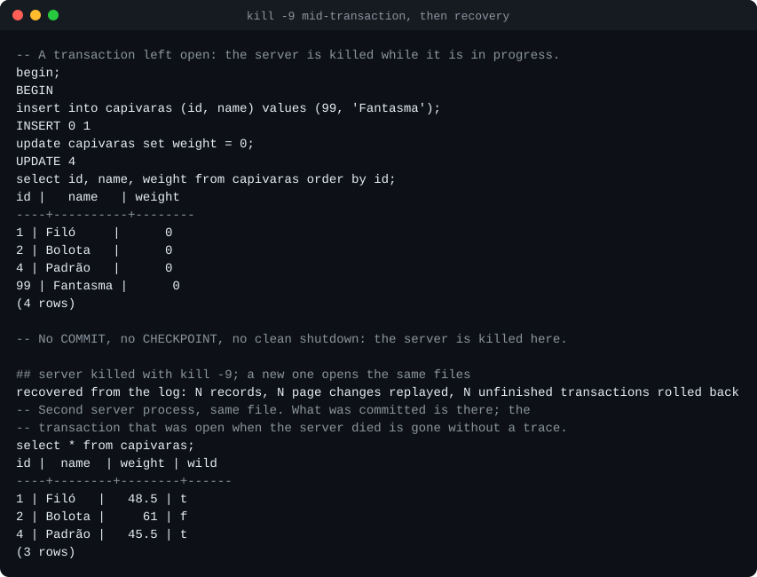
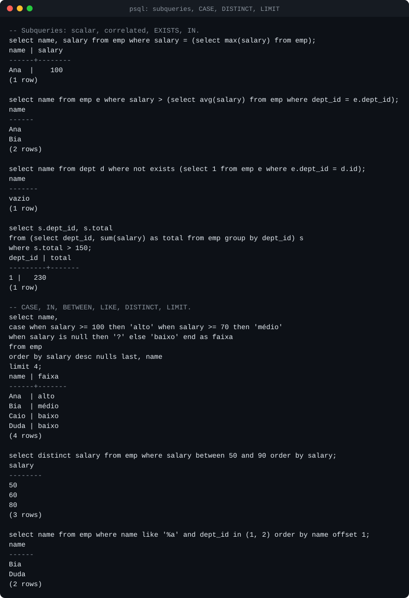
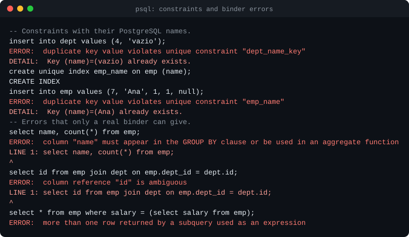
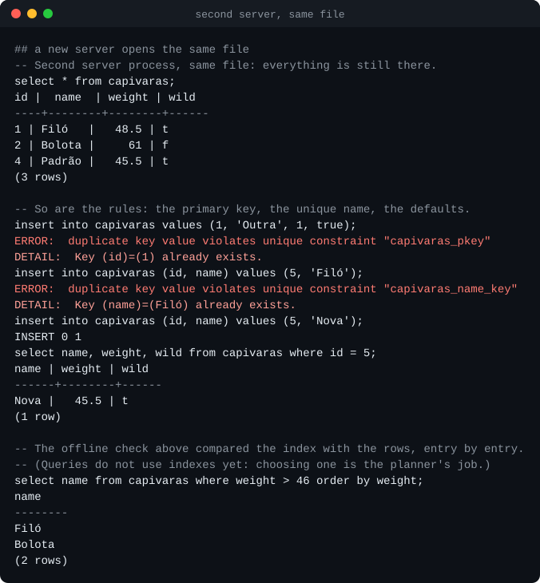
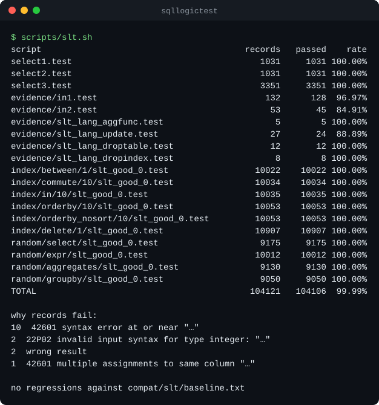
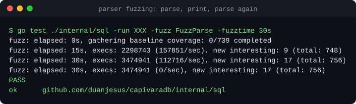
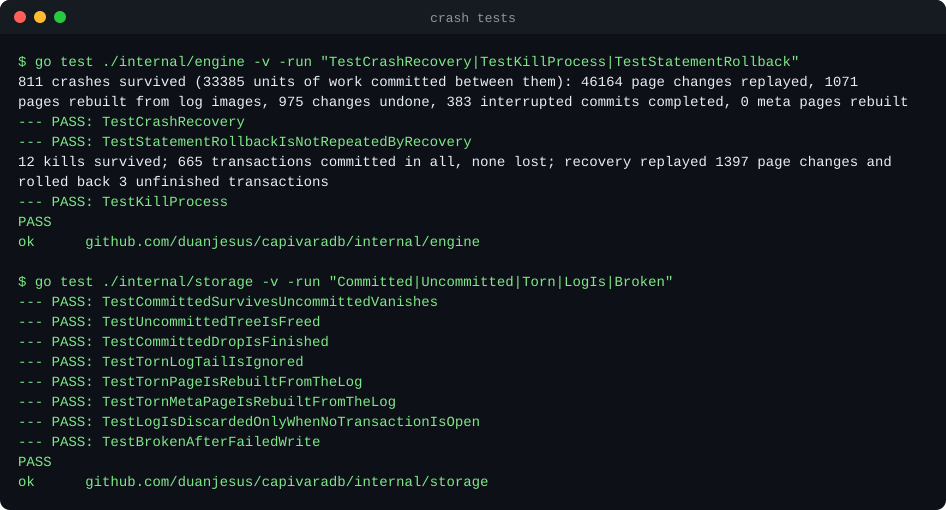
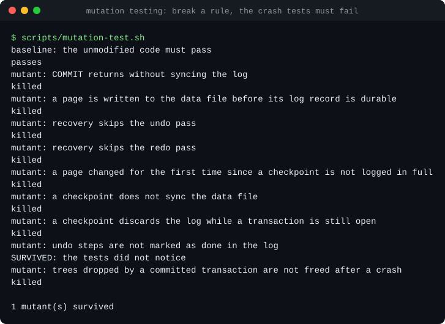
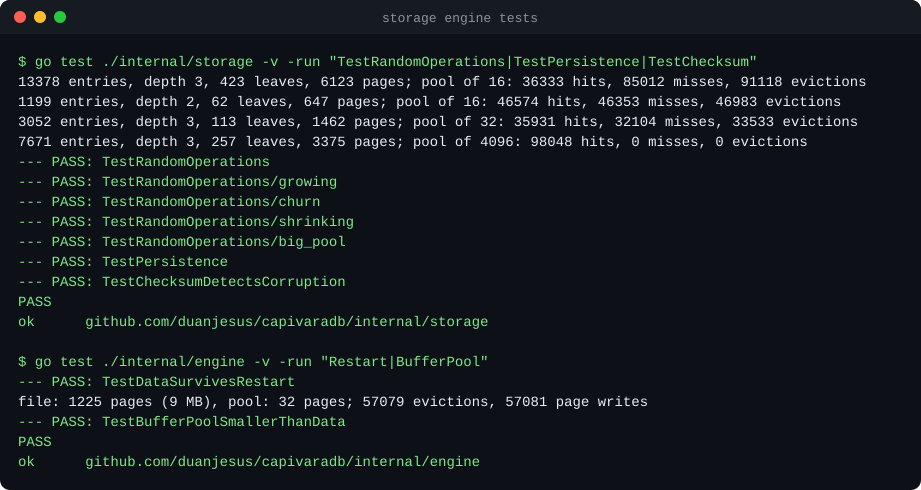

# CapivaraDB

A relational SQL database written from scratch in Go, speaking the PostgreSQL
wire protocol — so `psql`, pgx, JDBC and anything else that talks to Postgres
can connect to it.

The point of the project is to build every layer of a database by hand: the
network protocol, the SQL parser, the on-disk storage engine, write-ahead
logging with crash recovery, MVCC transactions, and a query planner and
executor. **The core has no dependencies outside the Go standard library**;
CI fails if one is added.

> **Status: milestone 4 of 7.** The wire protocol, the SQL front end, the
> storage engine and the write-ahead log are done: data lives in B+trees in
> a page file, and a committed transaction survives the server being killed
> or the power failing. Transactions are **not isolated from each other
> yet** — that is MVCC, next. See [Limitations](#limitations) for exactly
> what that means.



## Milestones

| # | Milestone | State |
|---|-----------|-------|
| 1 | PostgreSQL wire protocol v3: startup, simple and extended query, cancellation | **done** |
| 2 | Hand-written SQL parser and binder: joins, grouping, subqueries, DDL; fuzzing; sqllogictest | **done** |
| 3 | Storage engine: slotted pages, buffer pool, B+tree tables and secondary indexes, persistent catalog | **done** |
| 4 | Write-ahead log, ARIES-style recovery, crash tests on a simulated disk and by killing the process | **done** |
| 5 | MVCC with snapshot isolation, concurrent transactions, isolation tests | next |
| 6 | Cost-based planner: index selection, join ordering, `EXPLAIN` | planned |
| 7 | Volcano executor: hash and merge joins, aggregation, external sort, set operations | planned |

Details in [docs/roadmap.md](docs/roadmap.md).

## Quick start

Requires Go 1.27 or newer.

```bash
go run ./cmd/capivaradb -data capi.cdb
```

Without `-data` the database lives in memory. `-cache 64` sets the buffer
pool to 64 MB, `-addr` the listening address (default `127.0.0.1:5432`).

Then, from any PostgreSQL client:

```bash
psql -h 127.0.0.1 -U ana capi
```

```sql
create table capivaras (id int primary key, name text not null, weight double precision);
insert into capivaras values (1, 'Filó', 48.5), (2, 'Bolota', 61);
select name, weight * 2 from capivaras where weight > 50;
```

Any user name is accepted and no password is asked for, which is why the
server listens on loopback only unless told otherwise.

A commit is durable when it is acknowledged: the write-ahead log, kept in
`capi.cdb.wal`, is synced first. If the server dies, the next start recovers
from the log and says so. `capivaradb -data capi.cdb -check` verifies a file
offline; `-nosync` trades the power-failure guarantee for speed.

## What works today

### SQL

- **Queries:** `SELECT` with `INNER` / `LEFT` / `CROSS` joins, subqueries in
  `FROM`, `WHERE`, `GROUP BY`, `HAVING`, `DISTINCT`, `ORDER BY` (with
  `NULLS FIRST/LAST`, positions and aliases), `LIMIT` / `OFFSET`.
- **Subqueries in expressions:** scalar, `EXISTS`, `IN (SELECT ...)`,
  correlated to any depth.
- **Expressions:** arithmetic with overflow checks, comparisons, three-valued
  `AND`/`OR`/`NOT`, `CASE`, `IN`, `BETWEEN`, `LIKE`/`ILIKE`, `IS NULL`, `||`,
  `CAST` and `::`, `COALESCE`, `NULLIF`, and a few scalar functions.
- **Aggregates:** `count`, `sum`, `avg`, `min`, `max`, with `DISTINCT`.
- **DML:** `INSERT ... VALUES`, `INSERT ... SELECT`, `UPDATE`, `DELETE`.
- **DDL:** `CREATE TABLE` with `PRIMARY KEY`, `UNIQUE`, `NOT NULL` and
  `DEFAULT` (column and table level, composite keys), `CREATE [UNIQUE] INDEX`,
  `DROP TABLE`, `DROP INDEX`.
- **Transactions:** `BEGIN` / `COMMIT` / `ROLLBACK`, with real rollback
  (including of DDL) and statement atomicity.
- **Types:** `integer`, `bigint`, `double precision`, `text`, `boolean`.

The semantics follow PostgreSQL where the two could differ: what `GROUP BY`
allows in the select list, how names resolve across query levels, where
NULLs sort, what `NOT IN` does with a NULL in the set, which type an integer
literal has, how untyped parameters and quoted literals get their types.



Errors carry the SQLSTATE and wording PostgreSQL uses, and a position that
psql turns into a caret:



### Storage ([details](docs/storage.md))

- One file of 8 kB pages, each with a CRC-32C checksum verified on read.
- A buffer pool with pinning and clock eviction; the database can be far
  larger than the cache.
- B+trees with slotted pages, variable-length keys and values, overflow
  pages for large values, linked leaves for range scans, and page reuse
  through a free list.
- Tables are clustered B+trees keyed by primary key, in an order-preserving
  key encoding; secondary and unique indexes are B+trees too.
- A persistent catalog, itself a B+tree.
- A consistency checker that validates every tree, matches every index
  against its table and accounts for every page of the file.

The same storage engine runs under an in-memory database, so every test in
the repository — and all of sqllogictest — goes through the pager and the
B+tree.



### Durability ([details](docs/recovery.md))

- A write-ahead log with physical redo and logical undo; `fsync` at commit
  and before any page reaches the data file.
- ARIES-style recovery: analysis, redo, undo. Committed transactions are
  restored, unfinished ones rolled back, and a recovery interrupted by
  another crash simply runs again.
- Torn pages are rebuilt from full-page images in the log.
- Statements, transactions and DDL are atomic across a crash.
- Checkpoints on demand, at shutdown and by log size.

### Protocol ([details](docs/wire-protocol.md))

- Startup, including the `SSLRequest`/`GSSENCRequest` refusal and protocol
  minor-version negotiation.
- Simple query protocol, with multiple statements per message.
- Extended query protocol: `Parse`, `Bind`, `Describe`, `Execute`, `Close`,
  `Sync`, `Flush`; named and unnamed statements and portals; row limits with
  `PortalSuspended`; pipelining with correct skip-to-`Sync` error recovery.
- Text and binary formats for parameters and results.
- Parameter type inference when the client does not declare types
  (`where id = $1` reports `int4` back to the driver), across subqueries.
- Query cancellation through `CancelRequest`.

## How it is tested

| What | How | Where |
|------|-----|-------|
| Compatibility of results | **104 121 sqllogictest records, 99.99% passing**; CI fails on any regression | [docs/sqllogictest.md](docs/sqllogictest.md) |
| The parser | A corpus pinned to its canonical form, a parse → print → parse round trip, and a fuzzer that checks both on arbitrary input | [internal/sql](internal/sql) |
| The binder and executor | Table-driven tests of every construct, including the error cases | [internal/engine](internal/engine) |
| The B+tree and buffer pool | Long random operation sequences checked against a map, with a 16-page pool to force eviction; a fuzzer; invariants verified throughout; no page may leak | [internal/storage](internal/storage) |
| **Crash recovery** | A simulated disk that loses any subset of unsynced writes and tears the rest: ~800 crashes per run under a random workload, some during recovery itself, each compared with a shadow database | [docs/recovery.md](docs/recovery.md) |
| Crash recovery, for real | A writer process killed with `SIGKILL` a dozen times; every acknowledged commit must be there, whole | [internal/engine](internal/engine), [compat/restart](compat/restart) |
| The crash tests themselves | Mutation testing: nine ways of breaking the durability rules, each of which the tests must catch | `scripts/mutation-test.sh` |
| Persistence | Restart tests at the engine level; corruption must be detected by checksum | [internal/engine](internal/engine) |
| Storage integrity under SQL | The consistency checker runs after every engine test and after each sqllogictest script | `DB.Verify` |
| The protocol | A raw client written in the test from the specification, asserting exact message sequences | [internal/pgwire](internal/pgwire) |
| psql 17 | Scripted sessions compared with checked-in transcripts | [compat/psql](compat/psql) |
| pgx v5 (Go) | Every query execution mode, prepared statements, batches, transactions, cancellation, `database/sql` | [compat/pgx](compat/pgx) |
| pgjdbc 42.7 (Java) | Typed parameters, server-side prepare threshold, batches, autocommit off | [compat/jdbc](compat/jdbc) |



The sqllogictest number needs its caveat next to it: it covers one script of
each family in the corpus, on small in-memory tables. Two harder scripts are
measured separately and do much worse — 39% and 51% — because they
need set operations and a planner that do not exist yet.
[docs/sqllogictest.md](docs/sqllogictest.md) has the full picture.

The fuzzer feeds arbitrary bytes to the parser. It must never panic, and
anything it accepts must print to SQL that parses back to the same tree. It
found a real bug on its first run (a table made only of constraints printed
as invalid SQL); the input is now a regression seed.



The crash tests are the part of the project most worth looking at. A
database is run against a disk that fails at a random moment and keeps an
arbitrary part of what had not been synced; after recovery it must match a
shadow database that never crashed:



A crash test that passes proves little unless it would fail if the code
were wrong, so the tests are tested: each durability rule is broken in turn
and the suite must notice. It found two blind spots while it was being
written, both described in [docs/recovery.md](docs/recovery.md).



The storage tests report what the tree and the pool did — here, trees of
thousands of entries kept correct through tens of thousands of evictions:



B+tree benchmarks, with their conditions and caveats, are in
[docs/benchmarks.md](docs/benchmarks.md).

Screenshots from the first milestone (protocol, JDBC) are in
[docs/screenshots](docs/screenshots).

## Architecture

```
            psql / pgx / JDBC
                   │  PostgreSQL protocol v3 over TCP
        ┌──────────▼──────────┐
        │   internal/pgwire   │  framing, startup, simple + extended query,
        │                     │  portals, formats, cancellation
        └──────────┬──────────┘
                   │  Handler / Session / Prepared / Rows interfaces
        ┌──────────▼──────────┐
        │   internal/engine   │──▶ internal/sql: lexer, parser, printer
        │                     │  binder: scopes, types, grouping rules
        │                     │  executor: materialising, nested loops (for now)
        │                     │  rows ⇄ keys and tuples, catalog
        └──────────┬──────────┘
                   │  Get / Put / Delete / Seek on byte strings
        ┌──────────▼──────────┐
        │  internal/storage   │  B+trees, slotted pages, overflow pages,
        │                     │  buffer pool, page file, checksums
        └─────────────────────┘
```

The protocol layer knows nothing about SQL and the engine knows nothing
about sockets; they meet at four small interfaces. That boundary is what
lets the engine be swapped out milestone by milestone while the client
compatibility tests keep passing. More in
[docs/architecture.md](docs/architecture.md); the reasoning behind the main
choices is recorded in [docs/decisions](docs/decisions).

## Running the tests

```bash
go test ./...                          # core: parser, engine, storage, raw protocol
(cd compat/pgx && go test ./...)       # pgx driver
bash scripts/slt.sh                    # sqllogictest; downloads the scripts once
bash scripts/jdbc-smoke.sh             # pgjdbc; needs a JDK and curl
bash scripts/psql-smoke.sh             # psql; uses Docker if psql is not installed
bash scripts/restart-smoke.sh          # kill the server mid-transaction, recover, read
bash scripts/mutation-test.sh          # break the durability rules; the crash tests must fail
bash scripts/bench.sh                  # B+tree benchmarks
go test ./internal/sql -run XXX -fuzz FuzzParse -fuzztime 1m
go test ./internal/storage -run XXX -fuzz FuzzTree -fuzztime 1m
```

CI runs all of it on Linux (core suite under the race detector), plus the core
and pgx suites on Windows. See [docs/development.md](docs/development.md).

## Limitations

Stated plainly, because a database that overstates what it guarantees is
worse than useless.

- **No isolation.** Changes are visible to other sessions the moment a
  statement runs, before `COMMIT`. `BEGIN ISOLATION LEVEL ...` is parsed and
  ignored; `SHOW transaction_isolation` answers `read uncommitted`, which is
  the truth. Rollback does undo a transaction's changes, but if two open
  transactions touched the same rows the result is not what a real database
  would give. `DROP TABLE`, `DROP INDEX` and `CREATE INDEX` are refused
  while another transaction has uncommitted changes. (Milestone 5.)
- **Durability has edges.** Crash safety covers the server dying and the
  power failing. It does not cover the disk itself failing: a damaged page
  with no image in the current log is detected and reported, not repaired,
  and there are no backups or replication. One `fsync` per commit, with no
  group commit, bounds single-row transactions at the disk's sync rate
  (about 1 600 per second on the machine in
  [docs/benchmarks.md](docs/benchmarks.md)). The log cannot be discarded
  while a transaction is open, and a single value must fit in half the
  buffer pool.
- **One global lock.** Writers exclude everyone for the duration of a
  statement.
- **No planner.** Joins are nested loops in the order written, the `WHERE`
  clause is applied after the joins, and every scan is a full scan. A join
  that would materialise more than two million intermediate rows is refused
  rather than allowed to exhaust memory. Correlated subqueries are
  re-executed for every outer row. (Milestones 6 and 7.)
- **Indexes are maintained but not used by queries.** They enforce
  uniqueness with a B+tree lookup; no `SELECT` reads through one until the
  planner can choose to. (Milestone 6.)
- **Queries hold whole tables in memory.** The executor materialises every
  table it reads, so the buffer pool bounds the storage engine's memory but
  not a query's. (Milestone 7.)
- **Storage details:** a key (primary key or indexed columns) may be at most
  1024 bytes; pages are freed when empty but never merged; the file does
  not shrink; an `UPDATE` rewrites the whole row and its index entries.
- **Missing SQL:** `UNION` / `INTERSECT` / `EXCEPT`, `RIGHT` and `FULL`
  joins, `JOIN ... USING`, window functions, CTEs, `ALTER TABLE`, foreign
  keys, `CHECK` constraints, views.
- **Few data types.** No `numeric`, no date/time types, no arrays.
  `varchar(n)` does not enforce its length and `real` is stored as a double.
  Consequently `avg` and `sum` return `double precision` / `bigint` where
  PostgreSQL returns `numeric`.
- **No system catalogs.** psql's `\d` commands and GUI tools that inspect
  `pg_catalog` do not work.
- **No authentication and no TLS.** Trust authentication only; the client's
  request for SSL is declined.
- **No `COPY`**, no `LISTEN`/`NOTIFY`, no function-call sub-protocol.
- A multi-statement simple query is not wrapped in an implicit transaction
  as PostgreSQL does: statements before a failing one stay applied.

## Repository layout

```
cmd/capivaradb     the server binary
internal/pgwire    PostgreSQL wire protocol
internal/sql       lexer, AST, parser, printer
internal/engine    binder, executor, row and key encoding, catalog
internal/storage   page file, buffer pool, B+tree, write-ahead log, recovery,
                   consistency checker, simulated disk for crash tests
internal/pgerr     errors with SQLSTATE codes
compat/            tests against real clients and sqllogictest baselines
tools/slt          sqllogictest runner
tools/termshot     renders command output as the SVG screenshots in docs/
scripts/           smoke tests, sqllogictest and screenshot generation
docs/              architecture, protocol notes, decisions, roadmap
```

## License

[MIT](LICENSE)
