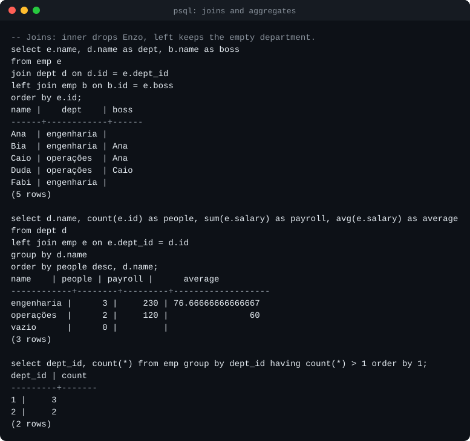

# CapivaraDB

A relational SQL database written from scratch in Go, speaking the PostgreSQL
wire protocol — so `psql`, pgx, JDBC and anything else that talks to Postgres
can connect to it.

The point of the project is to build every layer of a database by hand: the
network protocol, the SQL parser, the on-disk storage engine, write-ahead
logging with crash recovery, MVCC transactions, and a query planner and
executor. **The core has no dependencies outside the Go standard library**;
CI fails if one is added.

> **Status: milestone 2 of 7.** The wire protocol and the SQL front end are
> done and verified against real clients and against SQLite's sqllogictest
> corpus. Behind them sits a deliberately simple in-memory engine that the
> following milestones replace. Nothing is persisted yet. See
> [Limitations](#limitations) for exactly what that means.



## Milestones

| # | Milestone | State |
|---|-----------|-------|
| 1 | PostgreSQL wire protocol v3: startup, simple and extended query, cancellation | **done** |
| 2 | Hand-written SQL parser and binder: joins, grouping, subqueries, DDL; fuzzing; sqllogictest | **done** |
| 3 | Storage engine: slotted pages, buffer pool, B+tree tables and secondary indexes | next |
| 4 | Write-ahead log, ARIES-style recovery, kill-the-process crash tests | planned |
| 5 | MVCC with snapshot isolation, concurrent transactions, isolation tests | planned |
| 6 | Cost-based planner: index selection, join ordering, `EXPLAIN` | planned |
| 7 | Volcano executor: hash and merge joins, aggregation, external sort, set operations | planned |

Details in [docs/roadmap.md](docs/roadmap.md).

## Quick start

Requires Go 1.27 or newer.

```bash
go run ./cmd/capivaradb -addr 127.0.0.1:5432
```

Then, from any PostgreSQL client:

```bash
psql -h 127.0.0.1 -U ana capi
```

```sql
create table capivaras (id int primary key, name text not null, weight double precision);
insert into capivaras values (1, 'Filó', 48.5), (2, 'Bolota', 61);
select name, weight * 2 from capivaras where weight > 50;
```

Any user name is accepted and no password is asked for, which is why the
server listens on loopback only unless told otherwise.

## What works today

### SQL

- **Queries:** `SELECT` with `INNER` / `LEFT` / `CROSS` joins, subqueries in
  `FROM`, `WHERE`, `GROUP BY`, `HAVING`, `DISTINCT`, `ORDER BY` (with
  `NULLS FIRST/LAST`, positions and aliases), `LIMIT` / `OFFSET`.
- **Subqueries in expressions:** scalar, `EXISTS`, `IN (SELECT ...)`,
  correlated to any depth.
- **Expressions:** arithmetic with overflow checks, comparisons, three-valued
  `AND`/`OR`/`NOT`, `CASE`, `IN`, `BETWEEN`, `LIKE`/`ILIKE`, `IS NULL`, `||`,
  `CAST` and `::`, `COALESCE`, `NULLIF`, and a few scalar functions.
- **Aggregates:** `count`, `sum`, `avg`, `min`, `max`, with `DISTINCT`.
- **DML:** `INSERT ... VALUES`, `INSERT ... SELECT`, `UPDATE`, `DELETE`.
- **DDL:** `CREATE TABLE` with `PRIMARY KEY`, `UNIQUE`, `NOT NULL` and
  `DEFAULT` (column and table level, composite keys), `CREATE [UNIQUE] INDEX`,
  `DROP TABLE`, `DROP INDEX`.
- **Transactions:** `BEGIN` / `COMMIT` / `ROLLBACK`, with real rollback
  (including of DDL) and statement atomicity.
- **Types:** `integer`, `bigint`, `double precision`, `text`, `boolean`.

The semantics follow PostgreSQL where the two could differ: what `GROUP BY`
allows in the select list, how names resolve across query levels, where
NULLs sort, what `NOT IN` does with a NULL in the set, which type an integer
literal has, how untyped parameters and quoted literals get their types.


Errors carry the SQLSTATE and wording PostgreSQL uses, and a position that
psql turns into a caret:


### Protocol ([details](docs/wire-protocol.md))

- Startup, including the `SSLRequest`/`GSSENCRequest` refusal and protocol
  minor-version negotiation.
- Simple query protocol, with multiple statements per message.
- Extended query protocol: `Parse`, `Bind`, `Describe`, `Execute`, `Close`,
  `Sync`, `Flush`; named and unnamed statements and portals; row limits with
  `PortalSuspended`; pipelining with correct skip-to-`Sync` error recovery.
- Text and binary formats for parameters and results.
- Parameter type inference when the client does not declare types
  (`where id = $1` reports `int4` back to the driver), across subqueries.
- Query cancellation through `CancelRequest`.

## How it is tested

| What | How | Where |
|------|-----|-------|
| Compatibility of results | **104 121 sqllogictest records, 99.99% passing**; CI fails on any regression | [docs/sqllogictest.md](docs/sqllogictest.md) |
| The parser | A corpus pinned to its canonical form, a parse → print → parse round trip, and a fuzzer that checks both on arbitrary input | [internal/sql](internal/sql) |
| The binder and executor | Table-driven tests of every construct, including the error cases | [internal/engine](internal/engine) |
| The protocol | A raw client written in the test from the specification, asserting exact message sequences | [internal/pgwire](internal/pgwire) |
| psql 17 | Scripted sessions compared with checked-in transcripts | [compat/psql](compat/psql) |
| pgx v5 (Go) | Every query execution mode, prepared statements, batches, transactions, cancellation, `database/sql` | [compat/pgx](compat/pgx) |
| pgjdbc 42.7 (Java) | Typed parameters, server-side prepare threshold, batches, autocommit off | [compat/jdbc](compat/jdbc) |


The sqllogictest number needs its caveat next to it: it covers one script of
each family in the corpus, on small in-memory tables. Two harder scripts are
measured separately and do much worse — 39% and 51% — because they
need set operations and a planner that do not exist yet.
[docs/sqllogictest.md](docs/sqllogictest.md) has the full picture.

The fuzzer feeds arbitrary bytes to the parser. It must never panic, and
anything it accepts must print to SQL that parses back to the same tree. It
found a real bug on its first run (a table made only of constraints printed
as invalid SQL); the input is now a regression seed.


Screenshots from the first milestone (protocol, JDBC) are in
[docs/screenshots](docs/screenshots).

## Architecture

```
            psql / pgx / JDBC
                   │  PostgreSQL protocol v3 over TCP
        ┌──────────▼──────────┐
        │   internal/pgwire   │  framing, startup, simple + extended query,
        │                     │  portals, formats, cancellation
        └──────────┬──────────┘
                   │  Handler / Session / Prepared / Rows interfaces
        ┌──────────▼──────────┐
        │   internal/engine   │  binder: scopes, types, grouping rules
        │                     │  executor: in-memory, materialising (for now)
        └──────────┬──────────┘
                   │
        ┌──────────▼──────────┐
        │    internal/sql     │  lexer, AST, recursive-descent + Pratt parser,
        │                     │  canonical printer
        └─────────────────────┘
```

The protocol layer knows nothing about SQL and the engine knows nothing
about sockets; they meet at four small interfaces. That boundary is what
lets the engine be swapped out milestone by milestone while the client
compatibility tests keep passing. More in
[docs/architecture.md](docs/architecture.md); the reasoning behind the main
choices is recorded in [docs/decisions](docs/decisions).

## Running the tests

```bash
go test ./...                          # core: parser, engine, raw protocol
(cd compat/pgx && go test ./...)       # pgx driver
bash scripts/slt.sh                    # sqllogictest; downloads the scripts once
bash scripts/jdbc-smoke.sh             # pgjdbc; needs a JDK and curl
bash scripts/psql-smoke.sh             # psql; uses Docker if psql is not installed
go test ./internal/sql -run XXX -fuzz FuzzParse -fuzztime 1m
```

CI runs all of it on Linux (core suite under the race detector), plus the core
and pgx suites on Windows. See [docs/development.md](docs/development.md).

## Limitations

Stated plainly, because a database that overstates what it guarantees is
worse than useless.

- **No durability.** Data lives in memory and is gone when the process
  exits. (Milestones 3 and 4.)
- **No isolation.** Changes are visible to other sessions the moment a
  statement runs, before `COMMIT`. `BEGIN ISOLATION LEVEL ...` is parsed and
  ignored; `SHOW transaction_isolation` answers `read uncommitted`, which is
  the truth. Rollback does undo a transaction's changes, but if two open
  transactions touched the same rows the result is not what a real database
  would give. (Milestone 5.)
- **One global lock.** Writers exclude everyone for the duration of a
  statement.
- **No planner.** Joins are nested loops in the order written, the `WHERE`
  clause is applied after the joins, and every scan is a full scan. A join
  that would materialise more than two million intermediate rows is refused
  rather than allowed to exhaust memory. Correlated subqueries are
  re-executed for every outer row. (Milestones 6 and 7.)
- **Indexes are catalog entries.** `CREATE INDEX` is accepted; a unique
  index is enforced by scanning, and no index speeds anything up until the
  B+tree exists. (Milestone 3.)
- **Missing SQL:** `UNION` / `INTERSECT` / `EXCEPT`, `RIGHT` and `FULL`
  joins, `JOIN ... USING`, window functions, CTEs, `ALTER TABLE`, foreign
  keys, `CHECK` constraints, views.
- **Few data types.** No `numeric`, no date/time types, no arrays.
  `varchar(n)` does not enforce its length and `real` is stored as a double.
  Consequently `avg` and `sum` return `double precision` / `bigint` where
  PostgreSQL returns `numeric`.
- **No system catalogs.** psql's `\d` commands and GUI tools that inspect
  `pg_catalog` do not work.
- **No authentication and no TLS.** Trust authentication only; the client's
  request for SSL is declined.
- **No `COPY`**, no `LISTEN`/`NOTIFY`, no function-call sub-protocol.
- A multi-statement simple query is not wrapped in an implicit transaction
  as PostgreSQL does: statements before a failing one stay applied.

## Repository layout

```
cmd/capivaradb     the server binary
internal/pgwire    PostgreSQL wire protocol
internal/sql       lexer, AST, parser, printer
internal/engine    binder and executor (in-memory for now)
internal/pgerr     errors with SQLSTATE codes
compat/            tests against real clients and sqllogictest baselines
tools/slt          sqllogictest runner
tools/termshot     renders command output as the SVG screenshots in docs/
scripts/           smoke tests, sqllogictest and screenshot generation
docs/              architecture, protocol notes, decisions, roadmap
```

## License

[MIT](LICENSE)
